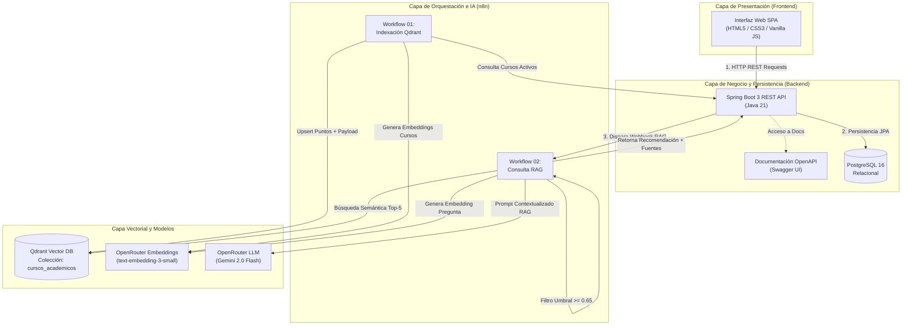

# Arquitectura del Sistema - RutaIA

## 1. Diagrama de Arquitectura de la Solución (Mermaid)

---

## 2. Componentes y Responsabilidades

### 2.1 Frontend Web
- **Tecnologías**: HTML5 semántico, CSS3 moderno (paleta HSL, tema oscuro con acentos violeta/cian, glassmorphism, responsive design), JavaScript ES6+ modular (Fetch API, async/await).
- **Responsabilidad**: Brindar una experiencia de usuario interactiva y fluida.
- **Regla Estricta**: Se comunica **únicamente** con la API REST de Spring Boot (`http://localhost:8080`). Nunca realiza llamadas directas a n8n, Qdrant u OpenRouter.

### 2.2 Backend Spring Boot
- **Tecnologías**: Java 21 LTS, Spring Boot 3, Spring Data JPA, Jakarta Validation, SpringDoc OpenAPI.
- **Responsabilidad**: Centralizar la lógica del negocio, validar entidades, registrar transaccionalmente las consultas, orquestar la llamada síncrona a n8n, almacenar las recomendaciones resultantes y sus fuentes con score, y exponer endpoints REST conformes a los estándares.
- **Manejo de Errores**: Controlador global de excepciones (`@RestControllerAdvice`) que formatea las respuestas de error bajo el estándar RFC 7807 (ProblemDetail).

### 2.3 Automatización n8n
- **Tecnologías**: n8n ejecutado en contenedor Docker.
- **Responsabilidad**: Orquestar el flujo de inteligencia artificial sin acoplar dependencias pesadas de IA al backend. Realiza la indexación por lotes de cursos y procesa las solicitudes RAG en tiempo real.

### 2.4 Base de Datos Vectorial Qdrant
- **Tecnologías**: Qdrant Engine v1.12 en Docker.
- **Responsabilidad**: Almacenar vectores de 1536 dimensiones correspondientes a las descripciones y metadatos de los cursos. Ejecuta búsquedas semánticas por similitud de coseno en milisegundos con filtrado por metadatos (`activo = true`).

### 2.5 OpenRouter (IA & Embeddings)
- **Modelos**:
  - `openai/text-embedding-3-small`: Para la generación de representaciones densas y normalizadas de 1536 dimensiones tanto de cursos como de consultas.
  - `google/gemini-2.0-flash-001`: Para la síntesis fundamentada y razonamiento vocacional basado estrictamente en el contexto institucional recuperado.
